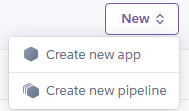
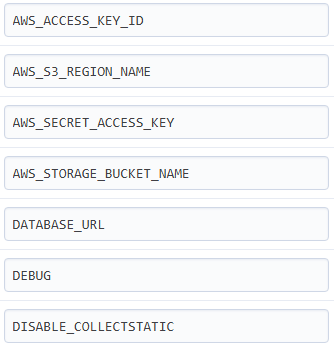
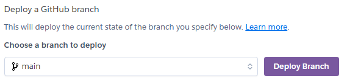

Art Flight!

Where your art career takes flight!

Link to live website:

https://art-flight-90b83d1ec001.herokuapp.com/

# UX

## Goals and Targets

### Target audience

Art Flight is aimed at hosting advertisements of artists' artwork and physical media for sale to users. The user can then purchase the artist's commission or physical media through Art Flight. The target audience is two separate groups: artists and customer users.

Artists will be the draw for our customers, and they will be the primary source of revenue. They will be able to advertise their works and skills on the website for users to purchase. Customer users are the user base that will be drawn to these services and spend money purchasing them.

As a note: in the real world, Art Flight would act as a money transfer, taking a percentage of the money and giving the rest to the artist. Due to knowledge and time constraints, a simple purchase method will be used instead as a proof of concept. Additionally, in the real world, the artist would get the option to accept or decline the customer user's order before money transfer. Once again, due to time and knowledge constraints, it will be a simple purchase system. These are active facts that I acknowledge and plan for.

### Minimum viable product goals

As a minimum viable product, Art Flight must:

* Allow all users to make create, read, edit, and delete purchases
* All users to be able to complete a purchase of a service
* Be able to search through services via tags and the search bar
* To be able to quickly navigate the menus, products, and services

### Additional goals

* Allow artists to upload content to the website
* Allow artists to be able to open or close their services

### New user goals

* Customers will want be able to quickly find services they want

#### Artists

* Artists will want to be able to set up their account quickly
* Artists will want to be able to create and decide their services

#### Customer users

* Customer users will want to be able to find their favourite artists quickly 
* Customer users will want to be able to find and choose their desired service/product

### Experienced user goals

#### Artists

* Artists will want to be able to manage and control their services
* Artists will want to be able to advertise their work as easily as possible to a large audience

#### Customer users

* Customer users will want to be able to quickly see what artists are available for commission
* Customer users will want to be able to quickly and easily make their purchases

## Design

### Styling

The website will need to be simple yet bold, using large blocks with simple standard colours. This is so that it appeals to as large a user base as possible. To give it some uniqueness, the website will also use light brown borders with no softening/radius to resemble a picture frame. Hovering over standard buttons (e.g.: links) will lighten the colours of the brown-bordered button. Hovering over buttons that delete or remove data will be red, and hovering over buttons that will add data/purchase-related will be a yellow/gold colour.

### Colour

The background to the whole website will be an off-shade of white, this is to keep it looking like a standard website without being bright enough to strain the user's eyes.

Borders will be a light brown to resemble a picture frame, with he light brown being two different shades of brown to keep it interesting. The border will be a class, split into top/right and bottom/left borders for their respective colours.

Standard buttons will be white with a brown border and text. This is to keep them within the style of the rest of the website and inform the user that the button neither deletes nor adds data. Buttons related to deleting or removing data will be red; this is due to red being the common warning of danger, which I will take advantage of. Finally, buttons related to purchasing will be yellow-gold in colour. This is because yellow is not only typically associated with happiness in colour theory, but it also resembles coin currency.

### Typography

Headers and titles throughout the site will use Nokora at weight 700.

Regular text throughout the site will use the Roboto font at weight 400.

## Wireframes and logic

### Wireframe

List of all pages needed:

### Database logic

#### Database and Model Design

Art Flight uses Django’s built-in ORM to manage the database and define how data is stored and related. The main model is the "Artist" model, which represents an artist post created by a user. Each "Artist" is linked to Django’s User model using a foreign key, meaning one user can create many artist posts, but each artist post belongs to only one user (one-to-many relationship). 

A separate UserProfile model is linked to the User model using a one-to-one relationship to store additional user information such as address details. Artist posts can be categorised using tags, which are stored in a separate Tag model to keep the data organised and reusable. This structure keeps the database clean, avoids duplicated data, and makes it easier to filter and manage artist posts across the site.

## Bugs and testing

### Manual vs automated testing

During development, I mainly used manual testing to check that the website functioned correctly from a user’s perspective. This included testing forms, navigation, and user features by interacting with the site in the browser. I did not implement any automated testing for this project due to my time limitations. In future development, automated testing could be added to help catch errors earlier and ensure core features continue to work as the project grows.

### Bug solving

#### Tag filter bug

When the user fills out the form to create a service, they fill out a 'tag' input. This tag input is free write due to the fact that we want the user to have free rein in what they tag their services as. However, the tags that the nav bar/artist page uses are the data in the JSON file, and as such, the doesn't naturally filter out tags correctly due to factors such as case sensitivity and spaces.

Artist test appearing:

Artist test not appearing when I search via the navbar tag 'sketch':

This is because I did not account for this in my tag filter section in my view:

[Link to md file containing the original view.py](RMbugsolving_view_original.md)

To fix this, I needed to update the filter system to remove all capitalisation and spacing from both the user's input and the tags in the JSON file.

[Link to md file containing the updated view.py](RMbugsolving_view_updated.md)

And now the test artist appears when using tag search:

## Final product

### Uploading/deploying product

#### Github

Firstly, I needed to create a requirements.txt file to list all dependencies required for the site to run properly. This is done by entering the following in the terminal:

    pip freeze --local > requirements.txt

Then, I needed to create a Procfile to specify to Heroku how to start the site. Creating the file, I filled it with this: release: 

    python manage.py collectstatic --noinput
    web: gunicorn art_flight.wsgi

Once these two were done, I added, committed, and pushed them to GitHub.

#### Heroku

The first step was to create a new app called Art Flight:

Next, I had to set up my config Variables, including turning off collect static in preparation for deployment to AWS:

After that, I had to connect my Heroku to my GitHub repository and deploy to Heroku:

Then ended it off by opening the Heroku console and applying any and all database migrations:

    python manage.py makemigrations
    python manage.py migrate

#### Amazon Web Services

I needed AWS to store static and media files.

The first step was to create an S3 bucket and an IAM user. Afterwards, I needed to assign a policy granting full access, then add these to my Heroku Config Vars:

Then I had to go back to my website/code and add boto3 django-storage with:

    pip install boto3 django-storages

Then, in my settings.py, I told it to use S3 as the default storage, and created custom_storages.py to handle locations.

Once this was all done, I updated, pushed, and redeployed the updated code.

#### Turning off debug

Once testing and alterations were finished, I set debug, located in Heroku, to off/False.

### Features

#### Current features

As of right now, the website can currently let users:

* Create accounts
* Search for artists by name, tags, and descriptions
* Allow users to create their own posts/advertisements
* Allow users to add items to baskets and commission artists 

#### Features to be added

In future updates, I would wish to add:

* Artist approval before a user does a purchase/money transfer for their services
* A "favourite" system inside the website itself, to help a user quickly find their regular artists
* A rating system for users to rate an artist
* A report system to report scams and other issues
* For commissions, the remaining slots number is to automatically go down once an artist accepts a commission

#### CRUD

* Create
    * Artist posts
    * Shopping lists
    * Accounts
* Read
    * Artist posts
    * Basket list
* Update
    * Artist posts
    * Basket quantity
    * Basket item options
* Delete
    * Own artist posts
    * Shopping list items
    * Accounts

To find evidence, please visit the CRUD.md file [here](CRUD.md).

#### Page speeds/Lighthouse

Upon testing with Lighthouse, all pages meet at least 90% on P.A.B.S., except for accessibility. This is mostly due to my navigation bar, with Lighthouse finding problems with sequential ordering and layout. Unless I redesign the navigation bar in a way that Lighthouse approves, I can not fix this.

To find all lighthouse reports for the website, follow this [link](lighthouse.md).

## Technology used

### Languages

* [HTML](https://en.wikipedia.org/wiki/HTML5)
* [CSS3](https://en.wikipedia.org/wiki/CSS#CSS_3)
* [JavaScript](https://en.wikipedia.org/wiki/JavaScript)
* [Python](https://www.python.org/)

### Code, media, frameworks, libraries, and programs used

* [Git](https://git-scm.com/) and [Github](https://github.com/) for version control and repository 
* [DJANGO](https://docs.djangoproject.com/en/4.1/releases/3.2/) for framework
* [lucid](https://lucid.app/) for creating the database logic chart
* Google fonts for the fonts on the website:
    * [Nokora for titles](https://fonts.google.com/specimen/Nokora?preview.size=34&categoryFilters=Feeling:%2FExpressive%2FCalm&preview.text=Lorem%20ipsum%20dolor%20sit%20amet,%20consectetur%20adipiscing%20elit.%20Morbi%20sed%20lectus%20turpis.%20Sed%20ut%20nisl%20ac%20felis%20pellentesque%20aliquet.%20Proin%20eget%20ultrices%20lacus.%20Proin%20ac%20elit%20est.%20Donec%20non%20viverra%20magna.%20Vestibulum%20eget%20egestas%20nisl,%20at%20auctor%20nibh.%20Maecenas%20dapibus%20vel%20eros%20et%20ornare.%20)
    * [Roboto for general text](https://fonts.google.com/specimen/Roboto?preview.size=12&categoryFilters=Feeling:%2FExpressive%2FBusiness&preview.text=Lorem%20ipsum%20dolor%20sit%20amet,%20consectetur%20adipiscing%20elit.%20Morbi%20sed%20lectus%20turpis.%20Sed%20ut%20nisl%20ac%20felis%20pellentesque%20aliquet.%20Proin%20eget%20ultrices%20lacus.%20Proin%20ac%20elit%20est.%20Donec%20non%20viverra%20magna.%20Vestibulum%20eget%20egestas%20nisl,%20at%20auctor%20nibh.%20Maecenas%20dapibus%20vel%20eros%20et%20ornare.%20)
* [Heroku](https://dashboard.heroku.com/) for hosting Art Flight
* [AWS](https://eu-north-1.console.aws.amazon.com/console/home?region=eu-north-1#) for bucket and static file handling
* [Stripe](https://stripe.com/gb) to implement and test payment processing
* [ChatGPT](https://chatgpt.com) to generate the site logo copyright-free
* [Validator.w3](https://validator.w3.org/nu/) to validate my HTML code
* [Jigsaw.w3](https://jigsaw.w3.org/css-validator/) to validate my CSS
* [Pep8ci](https://pep8ci.herokuapp.com) to validate my Python

### Thanks and acknowledgements
Thank you to Code Institute for providing me with the tutorials I need to make these websites.