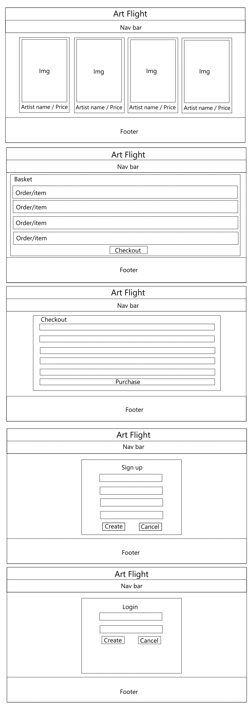
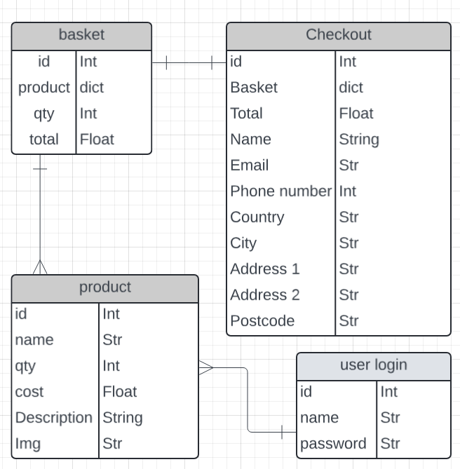
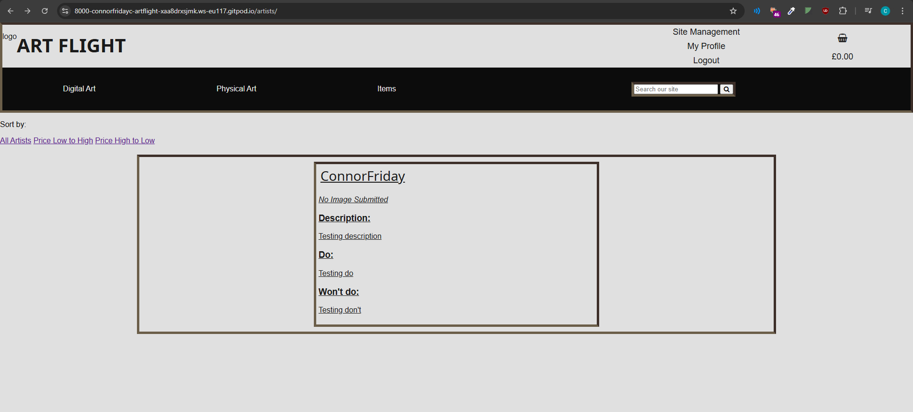
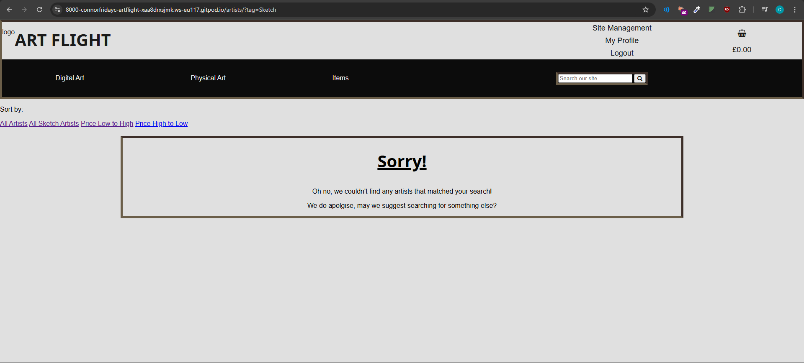
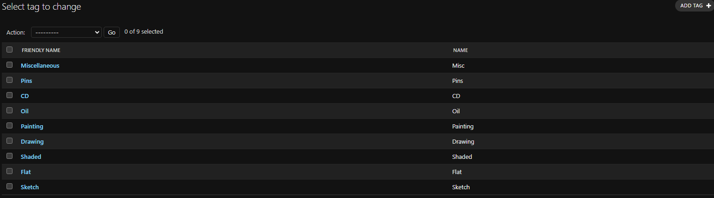
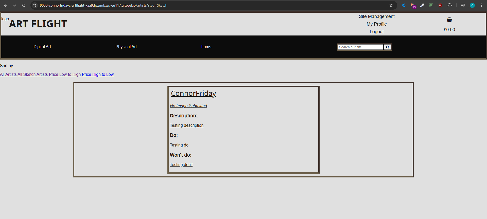
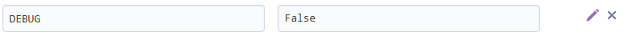

Art Flight!

Where your art career takes flight!

Link to live website:

# UX

## Goals and Targets

### Target audience

Art Flight is aimed at hosting advertisements of artists' artwork and physical media to sale to users. The user then can purchase the artist's commission or physical media through Art Flight. The target audience are two seperate groups: artists and customer users.

Artists will be the draw for our customers and money generating method. They will be able to advertise their works and skills on the website for user's to purchase. Customer users are the userbase that will be drawn in by these services and spend money purchasing these services.

As a note: in a real world Art Flight would act as a money transfer, taking a percentage of the money and giving the rest to the artist. Due to knowledge and time restraint, a simple purchase method will be used instead as a proof of concept. Also, in the real world the artist would get an option to accept or decline the customer user's order before money transfer. Once again due to time and knowledge restraint, it will be a simple purchase system. This are active facts that I acknowledge and plan for.

### Minimum viable product goals

As a minimum viable product, Art Flight must:
* Allow all users to make create, read, edit, and delete purchases
* All users to be able to complete a purchase of a service
* Be able to search through services via tags and search bar
* To be able to quickly navigate the menues, products, and services

### Additional goals

* Allow artists to upload content to the website
* Allow artists to be able to open or close their services

### New user goals

* Customers will want be able to quickly find services they want

#### Artists

* Artists will want to be able to quickly set up their account
* Artists will want to be able to create and decide their services

#### Customer users

* Customer users will want to be able to quickly find their favourite artists
* Customer users will want to be able to find and choose their desired service/product

### Experienced user goals

#### Artists

* Artists will want to be able to manage and control their services
* Artists will want to be able to advertise their work as easily as possible to a large audience

#### Customer users

* Customer users will want to be able to quickly see what artists are available for commission/media are available
* Cutomer users will want to be able to quickly and easily make their purchases

## Design

### Styling

The website will need to simple yet bold, using large blocks with simple standard colours. This is so it appeals to as large of a userbase as possible. Yet to also give it some uniqueness, the website will also use light brown borders with no softneing/radius to resemble a picture frame. Hovering over standard buttons (e.g.: links) will invert the colours of the brown-bordered button, hovering over buttons that delete or remove data will be red, and hovering over buttons that will add data/purchase related will be a yellow/gold colour.

### Colour

The background to the whole website will be a off-shade of white, this is to keep it looking like a standard website without being bright enough to strain the user's eyes.

Borders will be a light brown to resemble a picture frame, witht he light brown being two different shades of brown to keep it interesting. The souble colour border will be a class, split top/right and bottom/left borders for their respective colours.

Standard buttons will be standard white with a brown border and text. This is to keep them within style of the rest of website and inform the user that the button neither deletes or adds data. Buttons relating to deleting or removing data will be red, this is due to red being the common warning of danger which we will take advantage off. Finally, buttons related to purchasing will be yellow-gold in colour, this is because yellow is not only usually related to happiness in colour theory, but it also resembles coin currency.

### Typography

Headers and titles throughout the wite will use Nokora at weight 700.

Regualr text throughout the site will use Roboto font at weight 400.

## Wireframes and logic

### Wireframe

List of all pages needed:

### Database logic

## Bugs and testing

### Manual vs automated testing

### Bug solving

#### Tag filter bug

When the user inputs/fills out the form to create a service, they fill out a 'tag' input. This tag input is free write due to the fact of wanting the user to have free reign in what they tag their services as. However, the tags that the nav bar/artist page uses is the data in the JSON file, and as such, the doesn't naturually filter out tags correctly due to such things as case sensitivity and spaces.

Artist test appearing:

Artist test not appearing when I search via the navbar tag 'sketch':

This is because I did not account for this in my tag filter section in my view:

[Link to md file containing the original view.py](RMbugsolving_view_original.md)

As such to fix this, I needed to update the filter system to remove all capitals and spacing from both the user's input and the tags in the json file.

[Link to md file containing the updated view.py](RMbugsolving_view_updated.md)

And now the test artist appears when using tag search:

## Final product

### Uploading product

#### Github

#### Heroku

#### Amazon Web Services

#### Turning off debug

Once testing and alterations were finished, I set debug, located in Heroku, to off/False.

### Features

#### CRUD

* Create
    * Artist posts
    * Shopping lists
    * Accounts
* Read
    * Artist posts
    * Basket list
* Update
    * Artist posts
    * Basket quantity
    * Basket item options
* Delete
    * Own artist posts
    * Shopping list items
    * Accounts

To find evidence, please visit the CRUD.md file [here](CRUD.md).

#### Current features

As of right now, the website can currently let users:

* Create accounts
* Search for artists by name, tags, and descriptions
* Allow users to create their own posts/advertisments
* Allow users to add items to baskets and comission artists 

#### Features to be added

In future updates, I would wish to add:

* Artist approval before a user does a purchase/money transfer for their services
* A "favourite" system inside the website itself, to help a user quick find their reguluar artists
* A rating system for users to rate an artist
* A report system to report scams and other issues

#### Page speeds/lighthouse

## Technology used

### Languages

### Code, media, frameworks, libraries, and programs used

* [lucid](https://lucid.app/) for creating the database logic chart
* Google fonts for the fonts in the website:
    * [Nokora for titles](https://fonts.google.com/specimen/Nokora?preview.size=34&categoryFilters=Feeling:%2FExpressive%2FCalm&preview.text=Lorem%20ipsum%20dolor%20sit%20amet,%20consectetur%20adipiscing%20elit.%20Morbi%20sed%20lectus%20turpis.%20Sed%20ut%20nisl%20ac%20felis%20pellentesque%20aliquet.%20Proin%20eget%20ultrices%20lacus.%20Proin%20ac%20elit%20est.%20Donec%20non%20viverra%20magna.%20Vestibulum%20eget%20egestas%20nisl,%20at%20auctor%20nibh.%20Maecenas%20dapibus%20vel%20eros%20et%20ornare.%20)
    * [Roboto for general text](https://fonts.google.com/specimen/Roboto?preview.size=12&categoryFilters=Feeling:%2FExpressive%2FBusiness&preview.text=Lorem%20ipsum%20dolor%20sit%20amet,%20consectetur%20adipiscing%20elit.%20Morbi%20sed%20lectus%20turpis.%20Sed%20ut%20nisl%20ac%20felis%20pellentesque%20aliquet.%20Proin%20eget%20ultrices%20lacus.%20Proin%20ac%20elit%20est.%20Donec%20non%20viverra%20magna.%20Vestibulum%20eget%20egestas%20nisl,%20at%20auctor%20nibh.%20Maecenas%20dapibus%20vel%20eros%20et%20ornare.%20)
* [Heroku](https://dashboard.heroku.com/) for hosting Art Flight
* [AWS](https://eu-north-1.console.aws.amazon.com/console/home?region=eu-north-1#) for bucket and static file handling

### Thanks and acknowledgements
Thank you to Code Institute for providing me with the tutorials I need to make these websites.