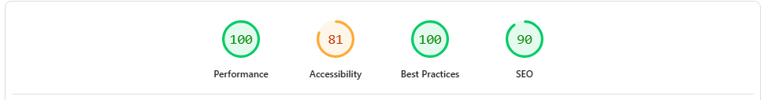

# User story testing

# Manual Testing

**Feature**         | **Testing method**      | **Result**                                            |
| ------------------ | ------------------- | ----------------------- |
Create accounts        |Attempting to create an account using an email| Works as  intended   |
Create artist posts         |   Using the create a service button/form in the user profile   |   Works as  intended |
Read commissions/artist posts         |  Find and reading an artist post using the tags or search bar    |   Both work as  intended |
Read basket list         |  Adding an item to my basket then checking if it is being displayed properly |   Works as  intended |
Read past orders         |  Finding the past orders page in the user profile section to find past orders    |   Works as  intended |
Update artist posts        |    Using the edit a service button/form in the user profile section |   Works as  intended |
Update basket quantity     |    Using the edit button/form on an item already in my basket to change the quantity   |   Works as  intended |
Update basket item options |    Using the edit button on an item already in my basket to change my commision option   |   Works as  intended |
Delete own artist posts    |    Using the delete a service button in the user profile section |   Works as  intended |
Delete basket list items   |    Adding an commission request to my basket then attempting to remove it with the delete button   |   Works as  intended |

# Lighthouse

## Welcome Page

## Artist page

## Artist post

# Basket and checkout

## Bag page

## Checkout page

UNABLE

Lighthouse is kicked back to artist page when attempting to test it (an error message is visable in the page screenshot that lighthouse takes).

# Profile

## My account page

## Create artist post page

## Past orders page

## Receipt page

# HTML

# CSS

# Python